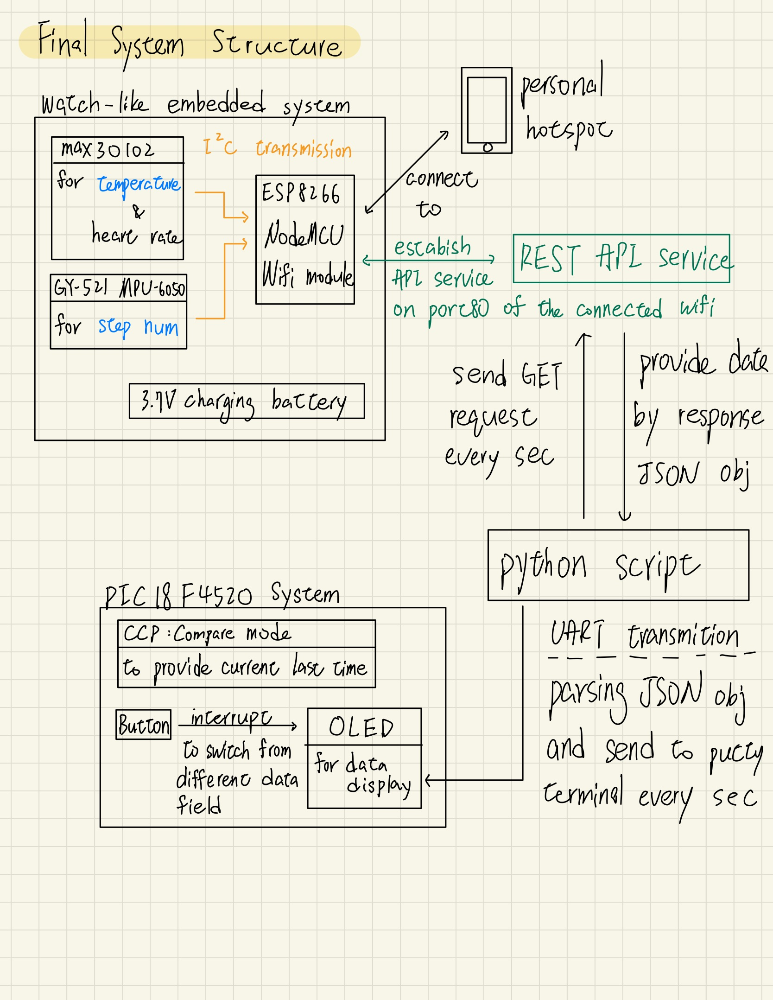

# Microcontroller Watch-like Fitness Tracker 

## About This Project

This project is the final project of the NCKU CSIE Microcontroller Course. It showcases a standalone, wearable, watch-like embedded system featuring advanced sensor integration, wireless data transmission, and user-friendly display capabilities.

### Key Features

1. **Hardware Components**:
   - **MAX30102**: Pulse oximeter and heart rate sensor for real-time biometric data.
   - **MPU-6050**: Gyroscope and accelerometer sensor for motion tracking.
   - **ESP8266 NodeMCU**: Wi-Fi module enabling wireless data transmission via a REST API.
   - **PIC18F4520 Microcontroller**: Responsible for processing sensor data and driving the display.
   - **SSD1306 OLED Display**: Compact screen for presenting user data.

2. **Power Supply**:
   - The system is self-powered, enabling complete wireless operation, akin to a traditional wristwatch.

3. **Data Communication**:
   - Sensor data is transmitted wirelessly over Wi-Fi using the ESP8266WebServer library, which provides a REST API service on port 80.
   - A Python script fetches sensor data every second and writes it to the serial port connected to the PIC18F4520 microcontroller.

4. **Display Features**:
   - The OLED display shows real-time data such as heart rate, temperature, and activity duration.
   - Users can toggle between different data views (e.g., heart rate, temperature, and sporting time) using a button interface.

5. **Sporting Time Measurement**:
   - A CCP (Capture/Compare/PWM) timer mode is implemented to calculate and display sporting time on the OLED screen.


## System Structure


## Directory/File explaination

### Tree
```
├── Gyroscope_controller
│   └── Gyroscope_controller.ino
├── README.md
├── System_Structure.jpg
├── embedded_sys_integrate
│   ├── data_transfer_script.py
│   └── embedded_sys_integrate.ino
├── max30102_controller
│   └── max30102_controller.ino
└── pic18f_controller
    └── Fitness_Tracker.X
        ├── Makefile
        ├── build
        │   └── default
        │       ├── debug
        │       │   ├── main.i
        │       │   ├── main.p1
        │       │   ├── main.p1.d
        │       │   ├── oled.i
        │       │   ├── oled.p1
        │       │   ├── oled.p1.d
        │       │   ├── setting.i
        │       │   ├── setting.p1
        │       │   ├── setting.p1.d
        │       │   ├── timer.i
        │       │   ├── timer.p1
        │       │   ├── timer.p1.d
        │       │   ├── uart.i
        │       │   ├── uart.p1
        │       │   └── uart.p1.d
        │       └── production
        │           ├── main.i
        │           ├── main.p1
        │           ├── main.p1.d
        │           ├── setting.i
        │           ├── setting.p1
        │           ├── setting.p1.d
        │           ├── timer.i
        │           ├── timer.p1
        │           ├── timer.p1.d
        │           ├── uart.i
        │           ├── uart.p1
        │           └── uart.p1.d
        ├── dist
        │   └── default
        │       └── debug
        │           ├── Fitness_Tracker.X.debug.cmf
        │           ├── Fitness_Tracker.X.debug.elf
        │           ├── Fitness_Tracker.X.debug.hxl
        │           ├── Fitness_Tracker.X.debug.lst
        │           ├── Fitness_Tracker.X.debug.map
        │           ├── Fitness_Tracker.X.debug.mum
        │           ├── Fitness_Tracker.X.debug.o
        │           ├── Fitness_Tracker.X.debug.rlf
        │           ├── Fitness_Tracker.X.debug.sdb
        │           ├── Fitness_Tracker.X.debug.sym
        │           └── memoryfile.xml
        ├── main.c
        ├── nbproject
        │   ├── Makefile-default.mk
        │   ├── Makefile-genesis.properties
        │   ├── Makefile-impl.mk
        │   ├── Makefile-local-default.mk
        │   ├── Makefile-variables.mk
        │   ├── Package-default.bash
        │   ├── configurations.xml
        │   ├── private
        │   │   └── configurations.xml
        │   └── project.xml
        ├── oled.c
        ├── oled.h
        ├── setting.c
        ├── setting.h
        ├── timer.c
        ├── timer.h
        ├── uart.c
        └── uart.h
```
### Explaination
- Gyroscope_controller directory: trying to connect gyroscope sensor (the one-and-only sensor) with ESP8266. It's a testing directory, which can be ommitted in the final system.
- max30102_controller directory: trying to connect max30102 sensor (the one-and-only sensor) with ESP8266. It's a testing directory, which can be ommitted in the final system.
- embedded_sys_integrate directory
    - `embedded_sys_integrate.ino` : integrate two sensors with ESP8266 and establish REST API for data transmission.
    - `data_transfer_script.py` : a python script that fetch the API every second and send data via UART to pic18f4520 by writing into serial port. 

## Wire Connection Info

### max30102 x ESP8266
- connect VCC in max30102 to 3v3 in ESP8266
- connect GND in max30102 to GND in ESP8266
- connect SCL in max30102 to D1(GPIO5) in ESP8266
- connect SDA in max30102 to D2(GPIO4) in ESP8266

### GY-521 x ESP8266
- connect VCC in max30102 to 3v3 in ESP8266
- connect GND in max30102 to GND in ESP8266
- connect SCL in max30102 to D1(GPIO5) in ESP8266
- connect SDA in max30102 to D2(GPIO4) in ESP8266

### OLED x pic18f4520
// TODO: Awaited Edit

## Hardware Info
- 0.96吋 4Pin IIC-I2C 白/藍/黃色 OLED 顯示器
- TP4056 1A 鋰電池充電板模組 TYPE-C
- ESP8266 WiFi NodeMCU 無線模組 
- GY-521 MPU-6050 模組（功能：三軸陀螺儀 + 三軸加速度計）
- MAX30102 血氧、心跳測量模組
